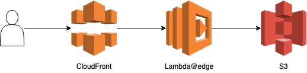

# cloudfront-lambda@edge

## 환경 구성

- [serverless framework](./etc/serverless.md)
- [aws cli](./etc/aws-cli.md)
- [terraform](./etc/terraform.md)

## 일정

- [ ] [step1](./step1.md) 환경 구성 및 Cloudfront & S3 구성
- [ ] [step2](.step2.md) terraform으로 infra 구축하기
- [ ] step3 serverless framework
- [ ] step4 lambda@edge

## Reference

- [AWS Lambda@Edge에서 실시간 이미지 리사이즈](https://medium.com/daangn/lambda-edge%EB%A1%9C-%EA%B5%AC%ED%98%84%ED%95%98%EB%8A%94-on-the-fly-%EC%9D%B4%EB%AF%B8%EC%A7%80-%EB%A6%AC%EC%82%AC%EC%9D%B4%EC%A7%95-f4e5052d49f3)