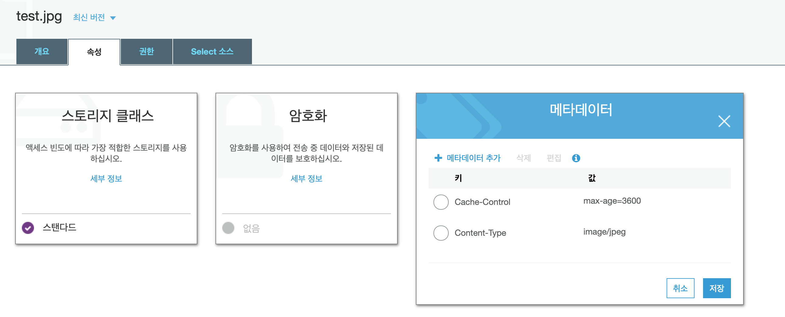

# Cache

## CloudFront

### CloudFront 동작

오리진의 응답은 파일 변경 여부에 따라 달라진다.

* CloudFront 캐시에 이미 최신 버전이 있는 경우 오리진에서는 304 상태 코드(수정되지 않음)를 반환한다.
* CloudFront 캐시에 최신 버전이 없는 경우 오리진에서는 200 상태 코드(OK)와 최신 버전의 파일을 반환한다.

Expires 헤더 필드 대신 Cache-Control max-age 명령을 사용하여 객체 캐싱을 제어하는 것이 좋다. Cache-Control max-age 및 Expires 모두에 대해 값을 지정한 경우, CloudFront에서는 Cache-Control max-age의 값만 사용한다.

#### Object Caching(Use Origin Cache Headers vs Customize)

cache-control 시간을 설정할 때 Minimum TTL, Maximum TTL, Default TTL의 기본 설정 값(0 / 31536000 / 86400)를 사용하는 경우 `Use Origin Cache Headers`를 사용하고 Minimum TTL, Maximum TTL, Default TTL 값을 변경하려면 Customize를 선택한다.

#### cache 시간 지정

origin의 `Cache-Control` 헤더를 설정하여 cloudfront의 cache ttl 시간과 브라우저 cache의 ttl 시간을 설정할 수 있다.

*Cache-Control max-age를 설정하지 않는 경우 브라우저에 cache가 동작하지 않을 수 있으므로 Cache-Control max-age를 추가해 주는 것이 좋다.*

> cloudfront의 cache 설정을 기본으로하고 origin의 header에 cache 관련 헤더가 없는 경우 Default TTL 값(86400 - 1일)만큼 cloudfront에 cache가 저장됩니다.

[자세한 cache cotrol header 설정 정보](https://docs.aws.amazon.com/ko_kr/AmazonCloudFront/latest/DeveloperGuide/Expiration.html#ExpirationDownloadDist)

### S3 metadata 설정으로 cache-control 헤더 변경

S3를 origin으로 사용하는 경우 Cache-Control 또는 Expires 헤더 필드는 S3 객체의 metadata에 설정할 수 있다.

S3 console에 들어가시면 속성 탭에서 아래와 같이 metadata를 수정할 수 있다.

