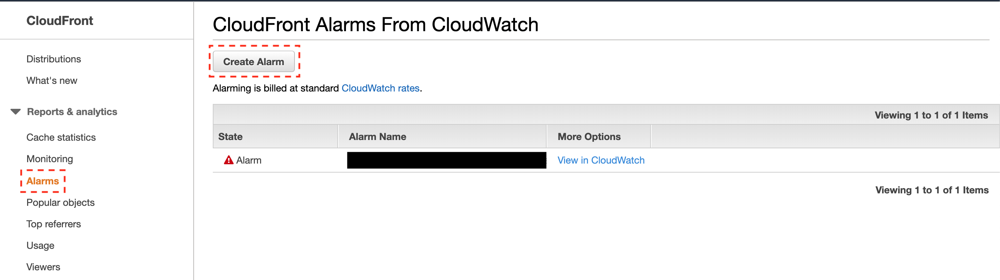
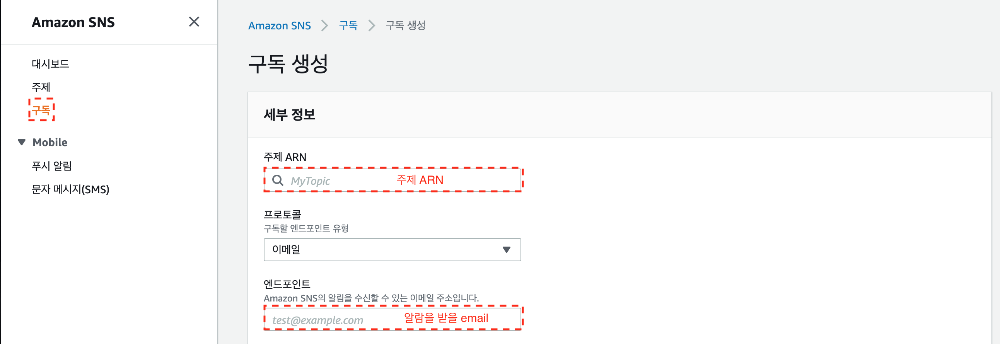

# cloudfront alarm

## cloudfront alarm 설정하기

### 1. cloudfront alarm 설정



### 2. sns 설정

#### 주제 생성

* AWS 계정의 CloudWatch 경보에서 다른 AWS 계정의 Amazon SNS 주제에 게시하는 것을 허용

  ```json
  {
  "Version": "2012-10-17",
  "Statement": [{
    "Effect": "Allow",
    "Principal": "*",
    "Action": "SNS:Publish",
    "Resource": "arn:aws:sns:us-east-1:444455556666:MyTopic",
    "Condition": {
    "ArnLike": {
        "aws:SourceArn": "arn:aws:cloudwatch:us-east-1:111122223333:alarm:MyAlarm"
    }
    }
  }]
  }  
  ```

#### 구독 생성



## 비용

### cloudwatch alarm

* 경보 지표 10개까지(tree tier)
* 표준 분해능(60초)	경보 지표당 0.10 USD
* 고분해능(10초) 경보 지표당 0.30 USD

> 표준 분해능 - 1분 세분화 데이터
> 고분해능 - 1초 세분화 데이터

## Reference

* [CloudFront 모니터링 및 경보 설정](https://docs.aws.amazon.com/ko_kr/AmazonCloudFront/latest/DeveloperGuide/monitoring-using-cloudwatch.html)
